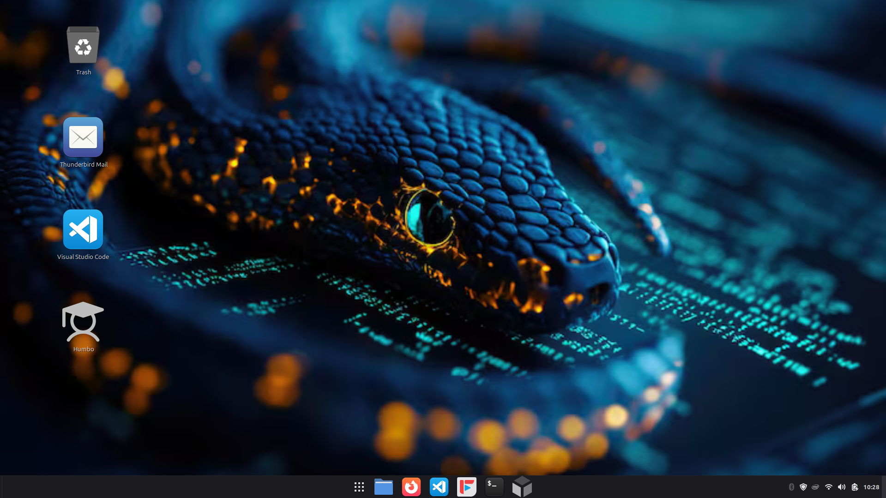

## Hi there 👋

Polish beginner programmer on his way to get the first IT job

Before I started coding I spent months to learning about linux, networking and computer science

I've tested many distros, but my favorite for its simplicity and reliability is just Linux Mint (cinnamon 🫶)

I've never participated in bootcamps and have not studied any IT-related subject, I am self-taught

---

#### Project:

---

#### Fun facts:

* I've been a truck driver (Poland, Germany, Czech Republic)
* I love listening creepypastas
* Tea with honey enjoyer

